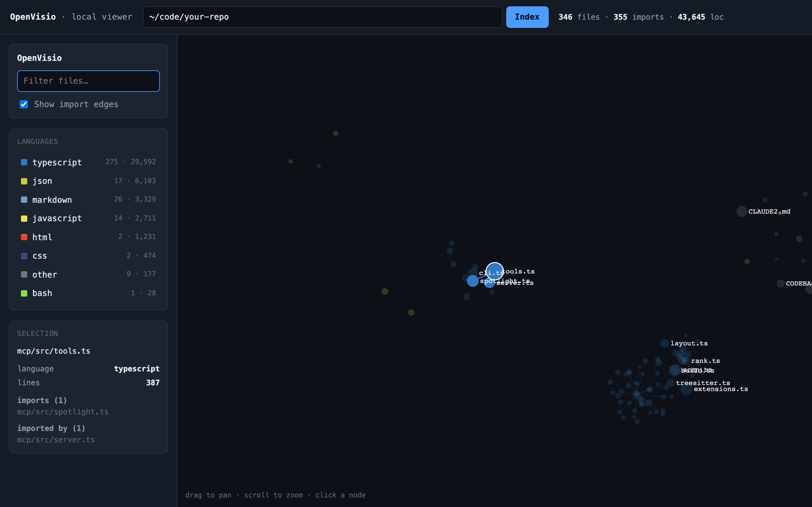

# OpenVisio — cut your AI coding agent's token usage with a code graph

[](LICENSE)
[](https://www.npmjs.com/package/openvisio)
[](https://www.npmjs.com/package/openvisio)
[](https://github.com/syntaxpriest/openvisio-oss)
[](https://github.com/syntaxpriest/openvisio-oss/actions/workflows/ci.yml)
[]()
[](https://openvisio.io)

**Website: [openvisio.io](https://openvisio.io)** · [npm](https://www.npmjs.com/package/openvisio) · [docs](https://openvisio.io)

> **Stop paying for tokens your coding agent wastes reading files.** OpenVisio is
> an [MCP server](https://modelcontextprotocol.io) that turns any repository into
> a deterministic **code graph** and serves **Claude Code, Cursor, Codex, Windsurf,
> Cline, and VS Code** a ranked, token-budgeted view — so the agent queries
> *structure* (symbols, imports, call edges, `path:line` anchors) instead of
> crawling and re-reading whole files. Same answers, a fraction of the context.
> **Local-first, read-only, no LLM in the engine — your code never leaves your machine.**

<p align="center">
  
  <br>
  <em>The viewer's <strong>Atlas</strong> view — every file and symbol as a constellation linked by imports, definitions, and calls (here: a 93K-file repo).</em>
</p>

---

## Why OpenVisio? Token savings, measured

AI coding agents explore a codebase the slow, expensive way: grep, open a file,
read it whole, follow its imports, re-read on a miss — and re-process all of it on
**every agent-loop turn**. On a real repo that's tens of thousands of tokens
burned *before the agent writes a single line*, and you pay for those tokens on
every request. OpenVisio replaces the crawl with **one ranked, `path:line`-anchored
graph query**, so the agent reads only the few lines it actually needs.

| To do this… | A no-graph agent | With OpenVisio | Leaner by |
|---|---|---|---|
| Build a whole-repo mental model | 92.1K tokens | 1.5K tokens | **~62×** |
| Explore enough to start a task | ~78K tokens / task | ~2.4K tokens / task | **~30×** |

> **Conservative projection** on a sample 65-file repo ([`bench/REPORT.frontend.md`](bench/REPORT.frontend.md)).
> It *under*-counts the real win: it ignores re-reads, the per-turn tool-definition
> tax, and Codex's ~3–5× agent-loop re-processing. Token savings concentrate in
> large, structured repos. **Measure it on yours:** `npm run bench`.

Fewer tokens per turn means **lower API bills, longer effective context windows,
fewer "context full" compactions, and faster responses** — without giving up
correctness, because every graph result carries a `path:line` anchor the agent can
fall back to for a real read.

---

## What it is

One deterministic code graph, two faces:

- **For your agent** — an [MCP](https://modelcontextprotocol.io) server (`openvisio`
  on npm) that gives Claude Code / Cursor / Codex / Windsurf a ranked, elided,
  token-budgeted view of the repo, so they query *structure* instead of crawling files.
- **For you** — a local viewer that draws the same graph as an **Atlas** (a
  navigable structural map) and a **City** (a 3D treemap where size and weight
  encode complexity), so you can see the shape of an unfamiliar repo at a glance.

OpenVisio parses any repository with **tree-sitter** into a symbol + import graph and
ranks it with **PageRank**. The graph is **deterministic and LLM-free**: same repo
bytes → same graph, same ids, every run. No network, no embeddings, no vector DB.

---

## Quick start (60 seconds)

```bash
npm install -g openvisio
cd your-project
openvisio
```

`openvisio` writes the project-scoped MCP configs (`.mcp.json` for Claude Code,
plus `.cursor/mcp.json` / `.vscode/mcp.json` when present) and runs a first index.
Open your agent in the folder, approve the `openvisio` server, and it queries the
code graph instead of reading files blindly.

Full CLI + tool reference: [`mcp/README.md`](mcp/README.md).

### Works with your agent

OpenVisio speaks the **Model Context Protocol** (the open standard from
**Anthropic**), so it drops into any MCP-capable coding agent:

| Agent / editor | Maker |
|---|---|
| **Claude Code** | Anthropic |
| **Cursor** | Anysphere |
| **Codex** | OpenAI |
| **Windsurf** | Codeium |
| **GitHub Copilot** (Agent Mode / VS Code MCP) | GitHub / Microsoft |
| **opencode** | SST |
| **Cline** | open source |
| **Continue** | Continue.dev |
| **Zed** | Zed Industries |
| **JetBrains** IDEs (via MCP) | JetBrains |
| any other MCP client | — |

> Trademarks belong to their respective owners. OpenVisio is an independent,
> MIT-licensed tool and is not affiliated with or endorsed by these companies — it
> simply implements the open Model Context Protocol they support.

For clients that aren't auto-configured, add the `openvisio` server by hand. For
example, [**opencode**](https://opencode.ai) reads `~/.config/opencode/opencode.json`
(or a project-local `opencode.json`):

```json
{
  "$schema": "https://opencode.ai/config.json",
  "mcp": {
    "openvisio": {
      "type": "local",
      "command": ["openvisio", "mcp", ".", "--watch"],
      "enabled": true
    }
  }
}
```

### Why token cost matters whatever model you run

Whether your agent calls **Anthropic Claude** (Opus, Sonnet, Haiku), **OpenAI**
(GPT, Codex), **Google Gemini**, **Meta Llama**, **Mistral**, **DeepSeek**, or a
local model, you pay — in dollars or latency — for every input token of context.
OpenVisio cuts the biggest, most wasteful slice of that bill: the repeated
file-crawling an agent does just to find where the relevant code lives.

### What the agent gets

| tool | what it does |
|------|--------------|
| `resolve_context` | task-ranked skeleton + neighborhoods of the most relevant files (call first) |
| `get_repo_skeleton` | the whole ranked repo map |
| `find_symbol` | locate a function/class/type → signature + `path:line` |
| `get_neighborhood` | local import subgraph around a file/symbol |
| `get_dependents` | who imports this (impact analysis) |
| `get_hotspots` | churn × centrality refactor/risk candidates |

Every line carries a `path:line` anchor, so agents read only the slice they need.
See [`bench/`](bench/) for the token-savings methodology and an A/B protocol you can
run on your own repo.

---

## Run the viewer — visualize any codebase

Once `openvisio` is installed, `view` indexes a repo and opens the bundled
**Atlas** and **City** views in your browser — zero install, served from
`127.0.0.1`:

```bash
openvisio view            # index the current repo and open the viewer
openvisio view ../other   # …or any other local repo
```

The viewer ships in the `openvisio-viewer` package: the same React/Three.js
Atlas + City **codebase visualization**, as a self-contained static bundle. It opens
on the **Atlas** by default; switch to the 3D **City** with the view toggle
(top-right). Click **Index** to point it at any local repo — browse the filesystem
in the built-in folder picker (git repos are flagged) or type a path — and a staged
progress loader runs while the deterministic engine indexes. Click any node to focus
it. Nothing leaves your machine.

**Watch your agent think.** `view` defaults to the spotlight port (7077), so it
doubles as the live-highlight hub: leave it running, point your agent at the repo
with `openvisio mcp . --spotlight`, and each tool call focuses the file it's
looking at — in real time.

From a clone, build the workspace first (`npm run build` builds the engine, the
viewer, and the CLI), then `node mcp/dist/cli.js view .`.

---

## Share a graph (transport)

`view` keeps everything on `127.0.0.1`. When you want a **shareable link** — the
same Atlas/City map plus an AI **narrator** — without uploading your source,
`transport` does the split: it indexes the repo **locally** (the heavy
tree-sitter scan stays on your machine, private and fast) and ships **only the
computed graph JSON** to a web server that renders it.

```bash
openvisio transport                 # index the current repo, upload the graph, open the link
openvisio transport ../other        # …or any other local repo
openvisio transport --no-open       # just print the URL, don't open a browser
openvisio transport --server=https://your-host   # send to your own deployment
```

What happens:

1. Index locally → build the deterministic graph.
2. Write a cached copy to `<repo>/.openvisio/graph.json` (auto-added to `.gitignore`).
3. `POST` just that graph JSON to `<server>/api/import`.
4. Open the rendered graph + narrator at `<server>/?g=<id>`.

Your source never leaves your machine — only the symbol/import graph is sent. The
destination defaults to `https://openvisio.io`; override it per-run with
`--server` or globally with the `OPENVISIO_SERVER` environment variable.

---

## FAQ

**How does OpenVisio reduce token usage in Claude Code / Cursor / Codex?**
Instead of letting the agent grep and read whole files (and re-read them every
turn), OpenVisio answers exploration queries from a precomputed code graph: a
ranked skeleton, the relevant neighborhoods, and `path:line` anchors. The agent
pulls a few hundred tokens of structure rather than tens of thousands of raw source —
typically **~30× fewer exploration tokens**, and **~62×** to prime a whole-repo
model (projected; see [bench](bench/)).

**Does my code get uploaded anywhere?**
No. The engine is **local-first and read-only** — indexing and parsing happen on
your machine, and the MCP server never makes a network call. The optional
`transport` command sends *only the computed graph JSON* (symbols + edges, no source)
to a viewer you choose, and even that defaults to off for normal use.

**How is this different from embeddings / RAG / vector search over my code?**
No embeddings, no vector database, no LLM in the indexer. OpenVisio is a
**deterministic static analysis** graph (tree-sitter parse + import resolution +
PageRank): same bytes → same graph, every run. It returns exact `path:line`
anchors, not fuzzy nearest-neighbor chunks — so there's nothing to hallucinate and
nothing to re-embed when the code changes.

**Which languages are supported?**
40+ via tree-sitter — TypeScript, JavaScript, Python, Go, Rust, Java, C/C++, C#,
Kotlin, Ruby, PHP, Swift, and more (full table below). Every other file still
becomes a graph node, so nothing in the repo is invisible.

**Does it work on large monorepos?**
Yes — that's where it pays off most. The token savings grow with repo size, and the
viewer has rendered 90K+ file graphs. Small/greenfield repos see smaller wins
(the explored set is already the whole repo).

**Is it free and open source?**
Yes — **MIT licensed**. `openvisio` and `openvisio-viewer` are on npm.

---

## Languages

OpenVisio parses these into symbols and import/call edges (tree-sitter grammars).
Any other text file is still scanned as a graph node — templates (Twig, Blade),
Markdown, and EDA/hardware files (KiCad, Gerber) get a language label without
parsed symbols, so nothing in the repo is invisible.

| Language           | Extensions                          |
| ------------------ | ----------------------------------- |
| TypeScript         | `.ts`, `.mts`, `.cts`               |
| TSX                | `.tsx`                              |
| JavaScript         | `.js`, `.jsx`, `.mjs`, `.cjs`       |
| Python             | `.py`, `.pyi`                       |
| Go                 | `.go`                               |
| Rust               | `.rs`                               |
| Java               | `.java`                             |
| C                  | `.c`, `.h`                          |
| C++                | `.cpp`, `.cc`, `.cxx`, `.hpp`, `.hh`|
| C#                 | `.cs`                               |
| Kotlin             | `.kt`, `.kts`                       |
| Ruby               | `.rb`                               |
| PHP                | `.php`                              |
| Swift              | `.swift` (disabled by default)      |
| Scala              | `.scala`                            |
| Dart               | `.dart`                             |
| Zig                | `.zig`                              |
| Lua                | `.lua`                              |
| R                  | `.r`, `.R`                          |
| Elixir             | `.ex`, `.exs`                       |
| Elm                | `.elm`                              |
| OCaml              | `.ml`, `.mli`                       |
| ReScript           | `.res`                              |
| Solidity           | `.sol`                              |
| TLA+               | `.tla`                              |
| Objective-C        | `.m`, `.mm`                         |
| Bash               | `.sh`, `.bash`                      |
| Vue                | `.vue`                              |
| HTML               | `.html`, `.htm`                     |
| CSS                | `.css`                              |
| JSON               | `.json`                             |
| YAML               | `.yaml`, `.yml`                     |
| TOML               | `.toml`                             |
| Embedded Template  | `.erb`, `.ejs`                      |
| SystemRDL          | `.rdl`                              |
| QL                 | `.ql`                              |
| Emacs Lisp         | `.el`                              |

> Swift's grammar is heavy enough to crash V8's WASM compiler on some machines,
> so it's off by default — enable it with `OPENVISIO_ENABLE_GRAMMARS=swift`.

---

## Repo layout

| Path | What it is |
|------|------------|
| [`core/`](core/) | `@openvisio/core` — the deterministic code-graph engine (tree-sitter parse, import resolution, PageRank, token-budgeted skeletons). |
| [`mcp/`](mcp/) | `openvisio` — the published MCP server + CLI. Bundles `core` into a single self-contained binary. |
| [`viewer/`](viewer/) | `openvisio-viewer` — the bundled Atlas + City app that `openvisio view` serves (React + Three.js, built to a static bundle). |
| [`ui/`](ui/) | Full Next.js web app (Atlas + City + AI narrator). |
| [`bench/`](bench/) | Token-savings estimator + A/B measurement protocol. |
| [`docs/`](docs/) | Engine, graph, and MCP integration notes. |

---

## Develop

Requires **Node 20+**.

```bash
npm install          # installs the core + mcp workspaces
npm run build        # build @openvisio/core, then bundle the openvisio CLI
npm run typecheck
npm run smoke        # end-to-end CLI smoke test
```

The viewer (`ui/`) installs independently — see [Run the viewer](#run-the-viewer--visualize-any-codebase).

Contributions welcome — see [CONTRIBUTING.md](CONTRIBUTING.md).

---

## Keywords

MCP server · Model Context Protocol · Anthropic Claude · Claude Code · Cursor
(Anysphere) · OpenAI Codex · GPT · Google Gemini · GitHub Copilot · Microsoft
VS Code · Windsurf · Codeium · Cline · Continue · Zed · JetBrains · opencode (SST) · Meta Llama ·
Mistral · DeepSeek · reduce token usage · save LLM tokens · lower API cost ·
token-efficient context · context engineering · code graph · code knowledge graph ·
codebase visualization · 3D code map · dependency graph · call graph · import graph ·
tree-sitter · static analysis · AI coding agent · AI pair programmer · local-first ·
read-only · privacy-first code tooling.

---

## License

[MIT](LICENSE) © OpenVisio contributors
